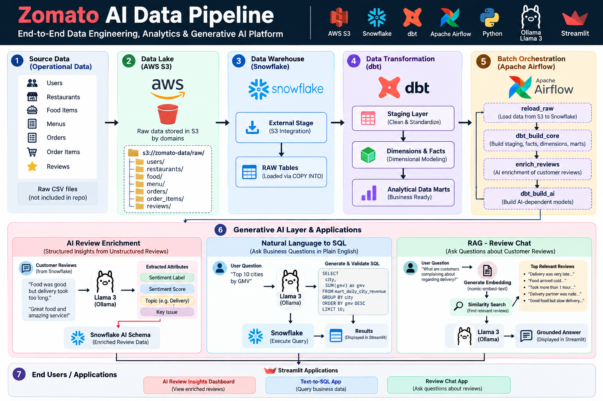

# Zomato AI Data Pipeline

An end-to-end **Data Engineering, Analytics, and Generative AI project** that processes Zomato-style food delivery data using **AWS S3, Snowflake, dbt, Apache Airflow, Python, Streamlit, and LLMs**.

The pipeline ingests raw operational data, transforms it into analytics-ready fact and dimension models, enriches customer reviews using AI, and provides natural-language interfaces for querying both structured business data and unstructured customer feedback.

## Architecture



---


## Project Overview

Food delivery platforms generate large volumes of data across customers, restaurants, orders, menu items, deliveries, and reviews.

This project builds an end-to-end platform to convert that raw data into useful business insights.

The system supports:

- Raw data ingestion from **AWS S3 to Snowflake**
- Data cleaning and transformation using **dbt**
- Dimensional modeling with **fact and dimension tables**
- Business-focused analytical marts
- Workflow orchestration using **Apache Airflow**
- AI-based customer review enrichment
- Natural Language to SQL analytics
- RAG-based question answering over customer reviews
- Interactive applications using **Streamlit**

---

## Architecture

```text
                       RAW DATA
                          |
                          v
                       AWS S3
                          |
                          v
               Snowflake External Stage
                          |
                          v
                  +---------------+
                  | Snowflake RAW |
                  +-------+-------+
                          |
                         dbt
                          |
                          v
                  +---------------+
                  |    STAGING    |
                  | Clean/Conform |
                  +-------+-------+
                          |
                         dbt
                          |
                          v
             +--------------------------+
             | Facts / Dimensions /     |
             | Analytical Data Marts    |
             +------------+-------------+
                          |
              +-----------+-----------+
              |                       |
              v                       v
        Structured Data          Customer Reviews
              |                       |
              v                       v
        Text-to-SQL App         AI Enrichment
              |                 Sentiment/Topic
              v                       |
          LLM -> SQL                   v
              |                Snowflake AI Schema
              v                       |
          Snowflake                    v
                              Review Insights Mart

                 Customer Reviews
                        |
                        v
                    Embeddings
                        |
                        v
                   RAG Retrieval
                        |
                        v
                      LLM
                        |
                        v
               Review Q&A Application


          Apache Airflow orchestrates the batch pipeline
```

---

## Technology Stack

| Layer | Technology |
|---|---|
| Cloud Storage | AWS S3 |
| Data Warehouse | Snowflake |
| Transformation | dbt |
| Orchestration | Apache Airflow |
| Programming | Python |
| Data Processing | Pandas, NumPy |
| Generative AI | Llama 3 via Ollama |
| Embeddings | nomic-embed-text |
| Application | Streamlit |
| Containerization | Docker |
| Version Control | Git & GitHub |

---

## End-to-End Data Flow

### 1. Raw Data

The project works with food-delivery datasets representing:

- Users
- Restaurants
- Food items
- Menus
- Orders
- Order items
- Customer reviews

The complete raw datasets are intentionally excluded from this repository because of their size.

---

### 2. AWS S3 Data Lake

Raw CSV files are stored in Amazon S3.

Conceptually:

```text
S3 Bucket
└── raw/
    ├── users/
    ├── restaurants/
    ├── food/
    ├── menu/
    ├── orders/
    ├── order_items/
    └── reviews/
```

Snowflake connects to S3 through a **Storage Integration**, avoiding hard-coded AWS access keys inside SQL scripts.

---

### 3. Snowflake Ingestion

Snowflake acts as the central cloud data warehouse.

The project contains SQL scripts for:

- Environment and schema setup
- S3 storage integration
- External stages
- CSV file formats
- Raw table creation
- `COPY INTO` ingestion

Main schemas include:

```text
RAW
BRONZE
STAGING
MARTS
SNAPSHOTS
AI
```

Raw files from S3 are loaded into Snowflake's RAW layer before downstream transformations begin.

---

## dbt Transformation Layer

dbt is responsible for transforming raw warehouse data into clean, reusable analytical models.

### Staging Layer

The staging models:

- Standardize column names
- Clean source values
- Apply data type conversions
- Prepare source tables for downstream modeling
- Derive useful attributes

Examples:

```text
stg_users
stg_restaurants
stg_food
stg_menu
stg_orders
stg_order_items
stg_reviews
```

---

## Dimensional Data Model

The analytics layer follows dimensional modeling principles.

### Dimension Tables

```text
DIM_CUSTOMER
DIM_RESTAURANT
DIM_FOOD
DIM_DATE
```

Dimensions provide descriptive information about the business entities.

### Fact Tables

```text
FCT_ORDERS
FACT_ORDER_ITEMS
```

Fact tables contain measurable business events such as orders, quantities, revenue, discounts, fees, and delivery metrics.

`FCT_ORDERS` uses an **incremental dbt model**, allowing new records to be processed without rebuilding the entire historical dataset during every run.

---

## Analytical Data Marts

Business-focused marts provide ready-to-query datasets for analytics and reporting.

### Daily City Revenue

```text
MART_DAILY_CITY_REVENUE
```

Used to analyze revenue performance across cities and dates.

### Restaurant Performance

```text
MART_RESTAURANT_PERFORMANCE
```

Provides restaurant-level performance metrics.

### Delivery SLA

```text
MART_DELIVERY_SLA
```

Helps identify delivery performance and service-level issues.

### Review Insights

```text
MART_REVIEW_INSIGHTS
```

Combines customer reviews with AI-generated sentiment and topic information.

---

## Apache Airflow Orchestration

Apache Airflow automates the batch pipeline.

The primary workflow follows:

```text
reload_raw
    |
    v
dbt_build_core
    |
    v
enrich_reviews
    |
    v
dbt_build_ai
```

### `reload_raw`

Loads source files from S3 into Snowflake RAW tables.

### `dbt_build_core`

Runs the core dbt transformations to create staging models, facts, dimensions, and business marts.

### `enrich_reviews`

Runs the Python AI enrichment pipeline against customer reviews.

### `dbt_build_ai`

Builds downstream dbt models that depend on the AI-enriched review data.

Airflow therefore acts as the central orchestration layer connecting ingestion, transformation, and AI processing.

---

# Generative AI Components

The project contains multiple AI capabilities instead of using an LLM only as a chatbot.

---

## 1. AI Review Enrichment

Customer review text is processed using **Llama 3 through Ollama**.

For each review, the model generates structured attributes such as:

```text
sentiment_label
sentiment_score
topic
key_issue
```

Topics can include areas such as:

```text
Food Quality
Delivery
Pricing
Service
Packaging
Other
```

Example:

```text
Review:
"Food was good but the delivery took too long."

AI Output:

Sentiment: Negative
Topic: Delivery
Key Issue: Slow delivery
```

The enriched results are stored in the Snowflake AI layer and later used by the review analytics mart.

This converts unstructured customer feedback into structured information that can be aggregated and analyzed.

---

## 2. Natural Language to SQL

The project includes a Streamlit application that allows users to query business data using plain English.

Example:

```text
User:
Top 10 cities by GMV
```

The application follows:

```text
Natural Language Question
          |
          v
        LLM
          |
          v
   Generate SQL
          |
          v
   SQL Validation
          |
          v
      Snowflake
          |
          v
       Results
          |
          v
      Streamlit
```

The application provides schema context to the LLM so that it can generate Snowflake-compatible SQL.

### SQL Safety

Before execution, generated SQL is validated.

The application permits read-only queries such as:

```sql
SELECT ...
```

and:

```sql
WITH ... SELECT ...
```

Destructive operations such as the following are rejected:

```text
DROP
DELETE
TRUNCATE
ALTER
UPDATE
INSERT
CREATE
GRANT
REVOKE
```

This reduces the risk of an LLM modifying warehouse data.

---

## 3. RAG-Based Review Chat

The project also implements **Retrieval-Augmented Generation (RAG)** for customer reviews.

This is separate from the Text-to-SQL application.

The flow is:

```text
Customer Question
       |
       v
Question Embedding
       |
       v
Similarity Search
       |
       v
Retrieve Relevant Reviews
       |
       v
Provide Reviews as Context
       |
       v
      LLM
       |
       v
Grounded Answer
```

Review embeddings are generated using:

```text
nomic-embed-text
```

The system calculates similarity between the user's question and review embeddings, retrieves the most relevant reviews, and provides them as context to Llama 3.

This allows questions such as:

```text
What are customers complaining about regarding delivery?
```

to be answered using relevant customer feedback rather than relying only on the LLM's general knowledge.

---

## Text-to-SQL vs RAG

The project demonstrates two different ways of interacting with data using Generative AI.

| Requirement | Approach |
|---|---|
| Revenue, orders, KPIs and numerical analytics | Text-to-SQL |
| Customer feedback and review understanding | RAG |
| Review classification | LLM enrichment |

This allows both **structured and unstructured data** to be queried through natural language.

---

## Repository Structure

```text
zomato-ai-data-pipeline/
│
├── ai/
│   ├── enrich_reviews.py
│   ├── rag_chat.py
│   └── text_to_sql.py
│
├── airflow/
│   ├── dags/
│   │   └── zomato_batch.py
│   ├── Dockerfile
│   └── docker-compose.yaml
│
├── snowflake/
│   ├── 01_setup.sql
│   ├── 02_storage_integration.sql
│   ├── 03_stage_and_formats.sql
│   ├── 04_raw_tables.sql
│   └── 05_copy_into.sql
│
├── zomato/
│   ├── models/
│   │   ├── staging/
│   │   └── marts/
│   ├── macros/
│   ├── analyses/
│   ├── snapshots/
│   ├── tests/
│   └── dbt_project.yml
│
├── .gitignore
└── README.md
```

---

## Example Business Questions

The platform can support questions such as:

```text
Which cities generate the highest GMV?

Which restaurants generate the most revenue?

What is the average delivery time by city?

Which cities have the worst delivery SLA?

Which cuisine receives the most orders?

What are customers complaining about?

Which review topics have the most negative sentiment?

What are the most common delivery-related complaints?
```

---

## Data Security

Sensitive credentials are not committed to the repository.

Secrets such as:

```text
SNOWFLAKE_PASSWORD
OPENAI_API_KEY
```

are supplied through environment variables.

Files containing local credentials or user-specific configuration are excluded through `.gitignore`, including:

```text
.env
profiles.yml
creds.txt
.user.yml
.venv/
```

The Snowflake S3 integration uses an IAM role-based Storage Integration instead of embedding AWS access keys in the project.

---

## Key Engineering Concepts Demonstrated

This project demonstrates practical implementation of:

- ETL / ELT pipelines
- Cloud data warehousing
- Data lake integration
- Dimensional data modeling
- Fact and dimension tables
- Incremental data processing
- Data transformation with dbt
- Workflow orchestration
- Containerized Airflow
- Environment-based secret management
- Generative AI integration
- Sentiment and topic extraction
- Text-to-SQL
- SQL safety validation
- Vector embeddings
- Cosine similarity
- Retrieval-Augmented Generation (RAG)
- Structured and unstructured data analytics

---

## Future Improvements

Potential enhancements include:

- Implementing CDC-based incremental source ingestion
- Adding dbt tests for stronger data-quality validation
- Introducing CI/CD with GitHub Actions
- Moving vector storage to a dedicated vector database
- Adding pipeline monitoring and alerting
- Deploying the Streamlit applications
- Adding BI dashboards on top of the MARTS layer
- Adding data lineage and observability
- Migrating local LLM workloads to a production inference service

---

## Project Goal

The goal of this project is to demonstrate how modern Data Engineering and Generative AI can work together in a single end-to-end architecture.

Rather than stopping at data ingestion and transformation, the platform makes processed data accessible through traditional analytics as well as natural-language AI interfaces.

The result is a pipeline that transforms raw operational data into:

**clean data → analytical models → business insights → AI-powered data interaction.**